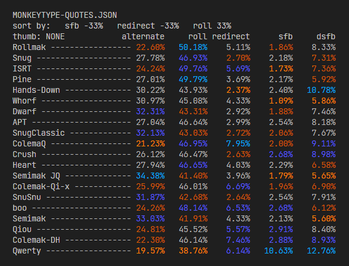
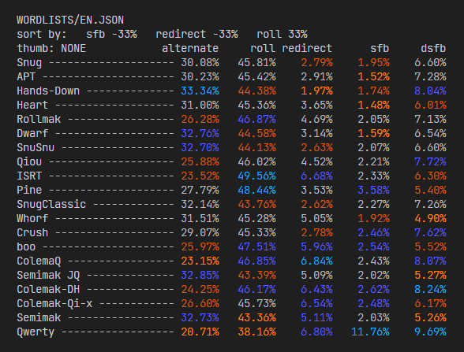
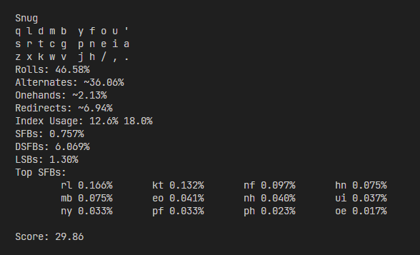
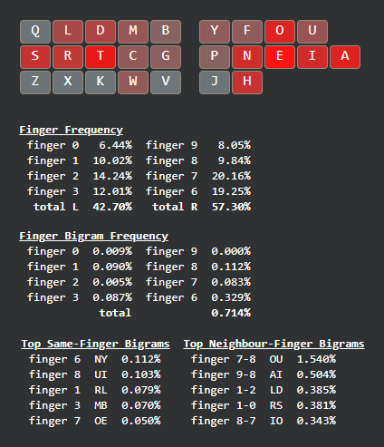
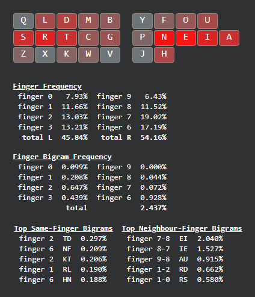

# Snug keyboard layout

Snug is an alternate keyboard layout optimized for increased typing comfort and speed in both English and German. The goal was to have as few SFBs as possible while keeping redirects low and rolls high. All of that without putting any important letters on the upper and lower pinky keys. The layout was created during countless days of layout analysis using [200-analyzer](https://github.com/ClemenPine/200-analyzer) and [genkey](https://semilin.github.io/genkey/), trying out variants on keyboards with different key layouts, feedback from other people, and a ton of manual optimization and of course typing.

## Definitions

SFB stands for **Same Finger Bigram**. Two keys are called an SFB if you have to use the same finger for typing the two letters in sequence. On QWERTY for example, `de`/`ed` are SFBs. You want as few SFBs as possible to increase typing comfort and speed. The word `follow` has four letters all typed with one finger which is neither comfortable nor fast.

**Redirects** are made up of three keys and your fingers kind of change direction when typing them. They are not very pleasant to type so you want to avoid these as well during layout creation. QWERTY examples: `sad`, `you`, `lip`.

**Rolls** are comfortable sequences of keys that are all typed with different fingers, going one direction on your hand, like `wet`, `hop`, and `awe`.

Scores for all of these factors play a role in the layout analysis.

## Keymap

### Matrix / ortholinear

```
q l d m b  y f o u '
s r t c g  p n e i a
z x k w v  j h / , .
```

### Row-stagger

```
q l d m b y f o u '
 s r t c g p n e i a
  z x k w v j h / , .
```

## Angle mod

The **angle mod** tries to make typing on the quite asymmetricly designed row-stagger keyboard layout more comfortable for the left hand. With how the rows of the keyboard are all slanted to the left even though your hands are symmetric you move your left hand in a way that can cause ulnar deviation which is not healthy. The solution proposed on the [Colemak DH keyboard layout page](https://colemakmods.github.io/mod-dh/) is to change which finger you use for the five lower left keys.

On traditional row-stagger the keys are `z x c v b` typed with fingers `5 4 3 2 2` where `5` is your pinky and `2` your index finger. With the angle mod you shift each finger over to the left by one key. The keys and fingers change this way: Type `x c v b z` with fingers `4 3 2 2 2`.

### Row-stagger with angle mod on ANSI keyboard

```
q l d m b y f o u '
 s r t c g p n e i a
  x k w v z j h / , .
```

### Row-stagger with angle mod on ISO keyboard

```
q l d m b y f o u '
 s r t c g p n e i a
z x k w v   j h / , .
```

If you have an additional key left of the `z` key like on ISO keyboards you can simply shift over the whole left row and don't have to reach far for the former `b` key anymore. You can bind that to something else that you use less often.

After getting used to the angle mod it should decrease typing fatigue on your left hand. You can give it a try and then decide what you like better. The angle mod works on row-stagger keyboards independently of the typing layout you use. Read more about it on [DreymaR's Big Bag of Keyboard Tricks](https://dreymar.colemak.org/ergo-mods.html#AngleWide).

## Column flip

One option that you have to maximize comfort for yourself is to flip the right inner column. Depending on the type of keyboard you use you might find one or the other way more comfortable to use. In German the letter `y` is almost non-existent so giving that letter the worst position is only natural. However in English it's used a lot. You can choose the variation with which you find typing the words `you` and `any` more enjoyable.

```
Default
y f o u '
 p n e i a
  j h / , .
```

```
Flipped
j f o u '
 p n e i a
  y h / , .
```

You could do the same thing on the left hand but I don't see any advantages there, common bigrams like `mb` and `bl` would become harder to type. I paid attention to minimizing awkward row jumps while working on Snug. In general with any layout you can usually move around keys within the same finger group. So if you re-arrange index keys to your liking or flip columns the important properties of the layout should stay the same because no letters change fingers. Keep row jumps in mind, though.

## History

After trying out several alternate keyboard layouts including [Colemak DH](https://colemakmods.github.io/mod-dh/), [ColemaQ](https://colemaq.github.io/), [ColemaQ-F](https://colemaq.github.io/variants.html), Colemak Qi;x, Colemak Qiou, [ISRT](https://notgate.github.io/layout/), Crustmak and Snu Snu, I did feel that the layout journey was going well but most these layouts had one thing in common: They were made with English in mind. They were great for typing in English and not optimal for typing in German. Many of them did not care about the `sc` and `eu` bigrams which are not common in English but appear very frequently in German. Optimizing for both languages was going to be difficult.

The last layout that I had tried out was called **Sertain**, made by Smudge. I did like it a lot but I did not like the name so I dubbed it **Snu Snu** because the creator's name started with `Snu` back then and it's a fun [Futurama reference](https://www.youtube.com/watch?v=fNsrvnHJdco) :)

Snug can be called a mod of Snu Snu, with its first iteration, a quite alternation-heavy version, looking quite similar.

### Snu Snu

```
x l d k v  z w o u ;
s r t n f  g y e i a /
q j m h b  p c ' , .
```

### Snug Classic

```
x l d m b  y w o u q
s r t n f  p c e i a
z j k h v  ' g / , .
```

### Snug
```
q l d m b  y f o u '
s r t c g  p n e i a
z x k w v  j h / , .
```

After a while of typing on this first iteration (now called *Snug Classic*) I felt that `sch` which is very common in German was slow and annoying to type so I swapped both index keys `n` and `c` to make `sch` an easy roll instead of a redirect and made adjustments around them to optimize for low SFBs again. The result is the low-alternation high-rolls **Snug** of today.

> **Snug** adjective (snugger; snuggest)
> 1. fitting closely and comfortably
> 2. enjoying or affording warm secure shelter or cover and opportunity for ease and contentment
> 3. affording a degree of comfort and ease

These meanings + Snu **Snu G**erman mod + good short layout name = Snug.

*Fun fact: Because of the `v'g` on the bottom of Snug Classic and it being a layout optimized for German, a name I had thought about previously was `V'Ger` like in the Star Trek movie. But then decided against it because this layout was surely going to be used on most computers one day and nobody wants the copyright issues :P*

## Analysis

### Corpus

During the layout creation process I tried different text corpora and the one that ended up being the most helpful was a parallel corpus consisting of a text available in both English and German. I ran analyses using the English part (EN), the German part (DE), them combined as the parallel corpus (ENDE), the classic Monkeytype Quotes corpus, and my exported chats from Discord.

You can find the English/German text that I used for the parallel corpus [here](https://www.statmt.org/europarl/).

The analyses were done using three different analysers:
- semilin's [genkey](https://semilin.github.io/genkey/)
- ClemenPine's [200-analyzer](https://github.com/ClemenPine/200-analyzer)
- The [Colemak Mods analyzer](https://colemakmods.github.io/mod-dh/analyze.html) using the default EN and DE corpora

The analyzers have different score calculations, please don't compare the scores of one analyzer to the other. For example genkey will usually show an SFB percentage around half that of the 200 analyzer.

### 200-analyzer

This analyzer can give you a very good overview over the scores of all your layouts. I sorted the results by "least SFBs, least redirects, most rolls" by running `./a200 sort -sfb -redirect roll`. All three factors will be considered so a layout being great in one aspect does not mean it will come out on top overall.

Every layout creator seems to find a way to make their layout come out on top of every analysis they show and it's no different here. Snug stays on the very top for all the analyses done for five different corpora. I consider this lucky but am very happy about it, too.

#### Monkeytype quotes corpus



#### EN corpus



#### DE corpus


#### ENDE corpus


#### Discord corpus

Snug still comes out on top when using real world example text from my Discord chat history which consists of English and German.


### genkey

#### Default corpus


#### EN corpus


#### DE corpus


#### ENDE corpus



### Colemak Mods analyzer

This analyzer is not too relevant anymore but it still was when I started researching custom layouts in 2021. Snug's score in English can kind of keep up with other top layouts. However using the German corpus it scores best out of all 40-ish alternate layouts in [mainstream's matrix keyboard layout list](https://cryptpad.fr/sheet/#/2/sheet/view/ij-3kKonjdIe8xjRVLFD-LFsspJxdw+DuV2ZCF-A15E/). The list keeps Colemak Mods analyzer scores for many top layouts.

#### EN corpus



#### DE corpus



## Inspiration, knowledge, tools

- [DreymaR's Big Bag of Keyboard Tricks](https://dreymar.colemak.org)
- [mainstream's matrix keyboard layout list](https://cryptpad.fr/sheet/#/2/sheet/view/ij-3kKonjdIe8xjRVLFD-LFsspJxdw+DuV2ZCF-A15E/)
- [ec0vid's Keyboard layout doc](https://bit.ly/keyboard-layouts-doc)
- [Norvig bigram frequencies](https://blogs.sas.com/content/iml/files/2014/09/bigrams.txt)
- [WordCreator character and syllable frequences](https://www.sttmedia.com/wordcreator-frequencies)
- [semi's "genkey" layout generator and analyzer](https://semilin.github.io/genkey/)
- [ClemenPine's "200-analyzer" layout analyzer](https://github.com/ClemenPine/200-analyzer)
- [European Parliament Proceedings Parallel Corpus](https://www.statmt.org/europarl/)
- [Colemak Mods analyzer](https://colemakmods.github.io/mod-dh/analyze.html)
- [Apsu's APT layout](https://github.com/Apsu/APT)
- [Colemak DH layout](https://colemakmods.github.io/mod-dh/)
- [ColemaQ layout and its variants](https://colemaq.github.io/)
- [ISRT layout](https://notgate.github.io/layout/)

## Referenced layouts

```
Colemak (Shai Coleman/2006)
q w f p g  j l u y ;
a r s t d  h n e i o
z x c v b  k m , . /
```

```
Colemak DH (stevep99/2014)
q w f p b  j l u y ;
a r s t g  m n e i o
z x c d v  k h , . /
```

```
ColemaQ (nyfee/2021)
; w f p b  j l u y q
a r s t g  m n e i o
z x c d k  v h / . ,
```

```
ColemaQ-F (nyfee/2021)
; w g p b  j l u y q
a r s t f  m n e i o
z x c d k  v h / . ,
```

```
Colemak Qi;x (nyfee/2021)
; l c m k  j f u y q
a r s t g  p n e i o
z x w d v  b h / , .
```

```
Colemak-Qiou (mainstream/2021)
q l c m k  j f o y '
a r s t g  p n e i u
z x w d v  b h , . /
```

```
Crush (mainstream/2022)
q l k m b  y f o u '
c r s t g  p n e i a
z x w d v  j h / , .
```

```
Crustmak (Apsu/2021)
q w f p k  j l u o ;
c r s t b  m n e a i
y x g d v  z h ' , .
```

```
Dwarf (StronglyTyped/2021)
f l h d v  z g o u .
s r n t m  p y e i a
x j b k q  c w ' , ;
```

```
ISRT (NotGate/2021)
y c l m k  z f u , '
i s r t g  p n e a o ;
q v w d j  b h / . x
```

```
Rollmak (Apsu/2022)
q w f p b  z l u o ,
c r s t g  m n e a i ;
v x y d k  j h / ' .
```

```
Sertain (Smudge/2021)
x l d k v  z w o u ;
s r t n f  g y e i a /
q j m h b  p c ' , .
```
